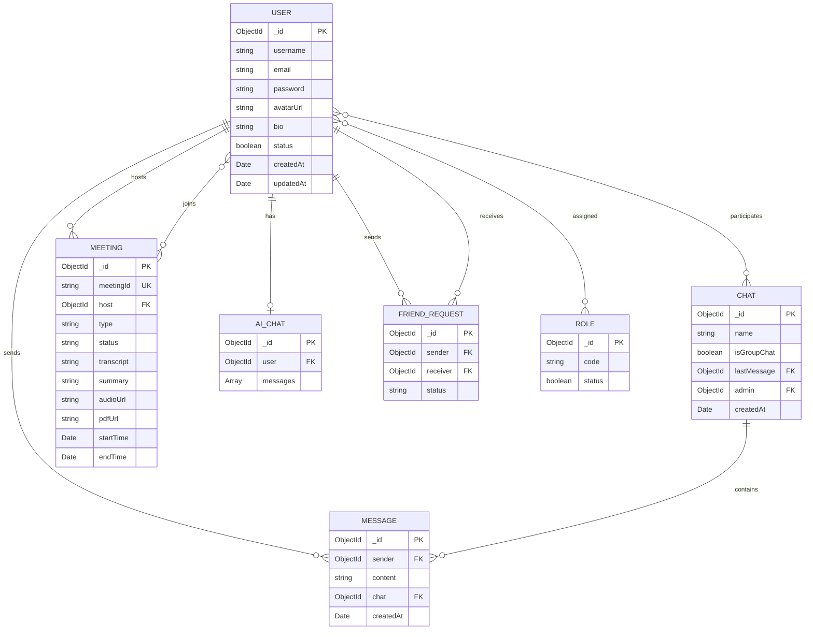

<p align="center">
  
</p>

<h1 align="center">🎙️ SAMVAAD AI</h1>

<p align="center">
  <strong>Intelligent Communication Platform with AI-Powered Meeting Intelligence</strong>
</p>

<p align="center">
  <a href="#-features"></a>
  <a href="#-tech-stack"></a>
  <a href="#-quick-start"></a>
  <a href="#-api-reference"></a>
</p>

<p align="center">
  
  
  
  
  
  
  
</p>

---

## 📋 Table of Contents

- [Overview](#-overview)
- [Features](#-features)
- [Architecture](#-architecture)
- [Tech Stack](#-tech-stack)
- [Project Structure](#-project-structure)
- [Quick Start](#-quick-start)
- [Configuration](#-configuration)
- [API Reference](#-api-reference)
- [Data Models](#-data-models)
- [WebSocket Events](#-websocket-events)
- [AI Services Pipeline](#-ai-services-pipeline)
- [Docker Deployment](#-docker-deployment)
- [CI/CD Pipeline](#-cicd-pipeline)
- [Contributing](#-contributing)
- [Changelog](#-changelog)

---

## 🌟 Overview

**SAMVAAD AI** (_संवाद_ — meaning _dialogue_ in Sanskrit) is a comprehensive real-time communication platform that combines instant messaging, video conferencing, and AI-powered meeting intelligence into a unified experience both for personal and professional teams.

> Built with a microservices architecture — a **React** frontend, **Node.js/TypeScript** backend, and **Python FastAPI** AI engine — SAMVAAD AI delivers transcription, speaker diarization, intelligent summarization, and PDF report generation out of the box.

---

## ✨ Features

### 💬 Real-Time Communication
| Feature | Description |
|---|---|
| **Instant Messaging** | 1:1 and group chats with real-time delivery via WebSocket |
| **File Sharing** | Share images, documents, and media with inline previews |
| **Typing Indicators** | Live "is typing…" events across chat rooms |
| **Chat Summarization** | AI-generated summaries of any conversation thread |
| **Friend Requests** | Send, accept, and manage friend connections |
| **Dark / Light Themes** | System-aware theme switching with manual toggle |

### 📹 Video Conferencing
| Feature | Description |
|---|---|
| **Peer-to-Peer Video** | WebRTC mesh topology for low-latency calls |
| **Meeting Rooms** | Create, join, and manage meetings with unique IDs |
| **In-Meeting Chat** | Send messages & emoji reactions during live calls |
| **Live Transcription** | Real-time speech-to-text during meetings |
| **Screen Sharing** | Share your screen with other participants |
| **Call Overlay** | Accept incoming calls from any page without navigation |
| **Participant Management** | Track join/leave events with timestamped logs |

### 🤖 AI Intelligence
| Feature | Description |
|---|---|
| **Audio Transcription** | Whisper ASR through both Groq Cloud & local Faster-Whisper |
| **Speaker Diarization** | Pyannote.audio-powered speaker identification |
| **Meeting Summarization** | Auto-generated summaries with action items & key topics |
| **PDF Report Generation** | Professional meeting reports with full transcript & summary |
| **AI Chat Assistant** | Streaming conversational AI with context memory (Ollama / Groq) |
| **Audio Optimization** | FFmpeg pipeline — 16kHz mono, bandpass filter, loudness normalization |
| **Smart Model Fallback** | Automatic retry across multiple LLM models on rate limits |
| **Intent Extraction** | Identify action items, decisions, and follow-ups from calls |
| **Translation** | Multi-language audio translation support |

### 🔐 Security & Auth
| Feature | Description |
|---|---|
| **JWT Authentication** | Access + Refresh token system with configurable expiry |
| **Password Hashing** | BCrypt with automatic salt generation |
| **Rate Limiting** | Express rate limiter to prevent abuse |
| **CORS Protection** | Configurable multi-origin CORS support |
| **Protected Routes** | Middleware-enforced auth on all sensitive endpoints |

---

## 🏗️ Architecture

```
┌────────────────────────────────────────────────────────────────────┐
│                         Client (React + Vite)                      │
│  ┌──────────┐ ┌──────────┐ ┌──────────┐ ┌──────────┐ ┌─────────┐ │
│  │  Auth    │ │   Chat   │ │ Meeting  │ │  AI Chat │ │  WebRTC │ │
│  │  Pages   │ │  System  │ │  System  │ │  Modal   │ │ Context │ │
│  └────┬─────┘ └────┬─────┘ └────┬─────┘ └────┬─────┘ └────┬────┘ │
│       │             │            │             │            │      │
│       └─────────────┴────────────┴─────────────┴────────────┘      │
│                    REST API  ·  WebSocket  ·  SSE                   │
└──────────────────────────────────┬─────────────────────────────────┘
                                   │
┌──────────────────────────────────┴─────────────────────────────────┐
│                     Backend (Node.js + TypeScript)                  │
│  ┌─────────┐ ┌──────────┐ ┌───────────┐ ┌──────────┐ ┌─────────┐ │
│  │  Auth   │ │  Chat    │ │  Meeting  │ │  AI Chat │ │  Socket │ │
│  │ Routes  │ │ Routes   │ │  Routes   │ │  Routes  │ │  Server │ │
│  └────┬────┘ └────┬─────┘ └─────┬─────┘ └────┬─────┘ └────┬────┘ │
│       │           │             │             │            │       │
│  ┌────┴────┐ ┌────┴─────┐ ┌────┴──────┐ ┌────┴─────┐     │       │
│  │  Auth   │ │  Chat    │ │  Meeting  │ │  AIChat  │     │       │
│  │  Ctrl   │ │  Ctrl    │ │   Ctrl    │ │   Ctrl   │     │       │
│  └─────────┘ └──────────┘ └─────┬─────┘ └────┬─────┘     │       │
│                                 │             │            │       │
│  ┌──────────────────────────────┴─────────────┴────────────┘       │
│  │  Services: AIService · GroqService · PDFService · AudioService  │
│  └──────────────────────────────┬──────────────────────────────────│
│                                 │                                  │
│  ┌──────────────────────────────┴──────────────────────────┐       │
│  │         MongoDB (Mongoose ODM)                          │       │
│  │  Models: User · Chat · Message · Meeting · Role · etc   │       │
│  └─────────────────────────────────────────────────────────┘       │
└──────────────────────────────────┬─────────────────────────────────┘
                                   │ HTTP
┌──────────────────────────────────┴─────────────────────────────────┐
│                    AI Services (Python · FastAPI)                   │
│  ┌──────────────┐ ┌────────────────┐ ┌────────────┐ ┌───────────┐ │
│  │ Diarization  │ │ Transcription  │ │ Translation│ │ Summarize │ │
│  │   Service    │ │    Service     │ │   Service  │ │  Service  │ │
│  └──────────────┘ └────────────────┘ └────────────┘ └───────────┘ │
│  Powered by: Pyannote.audio · Faster-Whisper · SpeechBrain · Torch│
└────────────────────────────────────────────────────────────────────┘
```

---

## 🛠️ Tech Stack

### Frontend
| Technology | Purpose |
|---|---|
| **React 18** | UI library with hooks & context API |
| **Vite 5** | Lightning-fast HMR & optimized builds |
| **Tailwind CSS 3** | Utility-first styling with dark mode |
| **React Router v6** | Client-side routing & nested layouts |
| **Socket.io Client** | Real-time bi-directional communication |
| **Zustand** | Lightweight global state management |
| **React Query (TanStack)** | Server state, caching & synchronization |
| **Framer Motion** | Smooth animations & micro-interactions |
| **React Hook Form + Zod** | Type-safe form validation |
| **Radix UI** | Accessible dialog & dropdown primitives |
| **Lucide React** | Modern icon system |

### Backend
| Technology | Purpose |
|---|---|
| **Node.js 18+** | JavaScript runtime |
| **TypeScript 5.4** | Type safety & developer experience |
| **Express.js 4** | HTTP server & REST API framework |
| **Socket.io 4** | WebSocket server for real-time events |
| **MongoDB + Mongoose 8** | Document database with ODM |
| **JWT (jsonwebtoken)** | Stateless authentication tokens |
| **BCrypt** | Secure password hashing |
| **Multer** | File upload middleware |
| **Groq SDK** | Cloud LLM inference (Llama, Qwen, etc.) |
| **Ollama** | Local LLM inference (fallback) |
| **PDFKit** | Programmatic PDF generation |
| **Fluent-FFmpeg** | Audio processing & optimization |
| **Morgan** | HTTP request logging |

### AI Services (Python)
| Technology | Purpose |
|---|---|
| **FastAPI** | High-performance async API server |
| **Faster-Whisper** | Optimized speech-to-text (CTranslate2) |
| **Pyannote.audio** | Neural speaker diarization |
| **PyTorch + TorchAudio** | Deep learning inference engine |
| **SpeechBrain** | Speaker embedding extraction |
| **Pydub** | Audio format conversion |
| **ReportLab** | Server-side PDF generation |

### Infrastructure
| Tool | Purpose |
|---|---|
| **Docker & Docker Compose** | Container orchestration |
| **Jenkins** | CI/CD automation pipeline |
| **Vercel** | Frontend hosting & analytics |
| **Nodemon** | Development hot-reload |
| **ESLint** | Code linting & quality enforcement |

---

## 📂 Project Structure

```
SAMVAAD AI/
│
├── 📁 client/                     # React Frontend (Vite)
│   ├── 📁 src/
│   │   ├── 📁 api/                # Axios API client
│   │   ├── 📁 assets/             # Static images & media
│   │   ├── 📁 components/
│   │   │   ├── 📁 meeting/        # Meeting-specific components
│   │   │   │   ├── CallOverlay.jsx
│   │   │   │   ├── CallWrapUp.jsx
│   │   │   │   ├── Chat.jsx
│   │   │   │   ├── Controls.jsx
│   │   │   │   ├── IncomingCallNotification.jsx
│   │   │   │   ├── InMeetingPersonalChat.jsx
│   │   │   │   ├── LiveTranscript.jsx
│   │   │   │   ├── ParticipantList.jsx
│   │   │   │   ├── ParticipantTile.jsx
│   │   │   │   └── VideoGrid.jsx
│   │   │   ├── 📁 ui/             # Reusable UI primitives
│   │   │   ├── AIChatModal.jsx    # In-app AI chat overlay
│   │   │   ├── ChatsSection.jsx   # Main chat panel
│   │   │   ├── MeetingDetail.jsx  # Post-meeting analytics
│   │   │   ├── MeetingSidebar.jsx # Meeting navigation
│   │   │   ├── UnifiedSidebar.jsx # Unified navigation sidebar
│   │   │   └── VideoChat.jsx      # WebRTC video component
│   │   ├── 📁 context/
│   │   │   ├── AuthContext.jsx    # JWT token management
│   │   │   ├── ChatContext.jsx    # Chat state & operations
│   │   │   ├── MeetingContext.jsx # Active meeting state
│   │   │   ├── SocketContext.jsx  # Socket.io connection
│   │   │   ├── ThemeContext.jsx   # Dark/light mode
│   │   │   ├── ToastContext.jsx   # Notification toasts
│   │   │   └── WebRtcContext.jsx  # Peer connection management
│   │   ├── 📁 hooks/
│   │   │   ├── useActiveSpeaker.js
│   │   │   ├── useCallStateManager.js
│   │   │   ├── useMeetingEngine.js    # Core meeting logic
│   │   │   └── useRealtimeTranscription.js
│   │   ├── 📁 pages/
│   │   │   ├── AIChat.jsx         # Standalone AI chat page
│   │   │   ├── Chat.jsx           # Main messaging page
│   │   │   ├── Login.jsx          # Auth login
│   │   │   ├── Register.jsx       # Auth registration
│   │   │   └── 📁 meeting/
│   │   │       ├── Home.jsx       # Create/join meeting
│   │   │       ├── Room.jsx       # Active meeting room
│   │   │       ├── History.jsx    # Past meetings list
│   │   │       └── Detail.jsx     # Meeting detail & reports
│   │   ├── App.jsx                # Root routes & providers
│   │   └── main.jsx               # Entry point
│   └── package.json
│
├── 📁 backend/                    # Node.js Backend (TypeScript)
│   ├── 📁 src/
│   │   ├── 📁 controllers/
│   │   │   ├── auth/              # Login, register, logout
│   │   │   ├── aiChat.controller.ts
│   │   │   ├── chat.controller.ts
│   │   │   ├── friendRequest.controller.ts
│   │   │   ├── meeting.controller.ts
│   │   │   ├── message.controller.ts
│   │   │   ├── pdf.controller.ts
│   │   │   └── user.controller.ts
│   │   ├── 📁 database/
│   │   │   ├── 📁 model/
│   │   │   │   ├── AIChat.ts      # AI conversation storage
│   │   │   │   ├── Chat.ts        # Chat rooms
│   │   │   │   ├── FriendRequest.ts
│   │   │   │   ├── Meeting.ts     # Meetings with transcripts
│   │   │   │   ├── Message.ts     # Chat messages
│   │   │   │   ├── Role.ts        # User roles
│   │   │   │   └── User.ts        # User accounts
│   │   │   └── 📁 repositories/   # Data access layer
│   │   ├── 📁 services/
│   │   │   ├── ai.service.ts      # AI orchestration layer
│   │   │   ├── audio.service.ts   # FFmpeg audio processing
│   │   │   ├── groq.service.ts    # Groq Cloud LLM integration
│   │   │   └── pdf.service.ts     # PDF report generation
│   │   ├── 📁 routes/             # Express route definitions
│   │   ├── 📁 socket/             # Socket.io event handlers
│   │   ├── 📁 middlewares/        # Auth & upload middleware
│   │   ├── 📁 validators/         # Request validation schemas
│   │   ├── 📁 core/               # ApiError & ApiResponse
│   │   ├── 📁 helpers/            # Utility functions
│   │   ├── config.ts              # Environment config
│   │   ├── app.ts                 # Express app setup
│   │   └── server.ts              # Server entry point
│   └── package.json
│
├── 📁 ai-services/                # Python AI Engine (FastAPI)
│   ├── 📁 app/
│   │   ├── main.py                # FastAPI app entry
│   │   ├── 📁 routes/
│   │   │   ├── transcribe.py      # Transcription endpoints
│   │   │   ├── diarize_transcribe.py
│   │   │   ├── translate.py       # Translation endpoint
│   │   │   ├── chat.py            # AI chat endpoint
│   │   │   ├── call_summary.py    # Call summarization
│   │   │   ├── intent_extraction.py
│   │   │   └── transcribe_stream.py
│   │   └── 📁 services/
│   │       ├── diarization_service.py
│   │       ├── transcription_service.py
│   │       ├── translate_service.py
│   │       └── ollama_chat.py
│   ├── requirements.txt
│   └── .env
│
├── docker-compose.yml             # Multi-service orchestration
├── Jenkinsfile                    # CI/CD pipeline definition
└── README.md
```

---

## 🚀 Quick Start

### Prerequisites

| Requirement | Version | Notes |
|---|---|---|
| **Node.js** | ≥ 18.x | [Download](https://nodejs.org/) |
| **npm** | ≥ 9.x | Included with Node.js |
| **Python** | ≥ 3.8 | [Download](https://python.org/) |
| **MongoDB** | ≥ 6.x | Local or [Atlas](https://cloud.mongodb.com) |
| **FFmpeg** | Latest | Required for audio processing |
| **Docker** | Latest | _Optional_ — for containerized deployment |

### 1️⃣ Clone the Repository

```bash
git clone https://github.com/ChittalaUday/Smavaad-Ai.git
cd Smavaad-Ai
```

### 2️⃣ Backend Setup

```bash
cd backend
npm install
cp .env.sample .env   # Then edit with your values
npm run dev            # Starts on http://localhost:5000
```

### 3️⃣ Frontend Setup

```bash
cd client
npm install
cp .env.sample .env   # Then edit with your values
npm run dev            # Starts on http://localhost:3002
```

### 4️⃣ AI Services Setup

```bash
cd ai-services
python -m venv venv

# Activate virtual environment
# Linux/Mac:
source venv/bin/activate
# Windows:
venv\Scripts\activate

pip install -r requirements.txt
uvicorn app.main:app --reload --port 8000   # Starts on http://localhost:8000
```

### 5️⃣ Docker (One-Command Start)

```bash
docker-compose up --build
```

> This starts **backend** (:5000), **client** (:3002), and **MongoDB** (:27017) together.

---

## ⚙️ Configuration

### Backend Environment Variables

Create `backend/.env`:

```env
# ─── Server ─────────────────────────────
NODE_ENV=development
PORT=5000
CORS_URL=http://localhost:3002
SERVER_URL=http://localhost:5000

# ─── Database ───────────────────────────
DB_URL=mongodb://localhost:27017
DB_NAME=SAMVAAD_AI
DB_MIN_POOL_SIZE=2
DB_MAX_POOL_SIZE=5

# ─── Authentication ────────────────────
JWT_SECRET_KEY=your-super-secret-key
COOKIE_VALIDITY_SEC=172800
ACCESS_TOKEN_VALIDITY_SEC=182800
REFRESH_TOKEN_VALIDITY_SEC=604800
TOKEN_ISSUER=api.samvaad.ai
TOKEN_AUDIENCE=samvaad.ai

# ─── AI Configuration ──────────────────
AI_SERVICE_URL=http://127.0.0.1:8000/api
AI_PRIMARY_PROVIDER=groq          # "groq" or "ollama"
GROQ_API_KEY=your-groq-api-key
GROQ_MODEL=llama-3.3-70b-versatile
```

### Frontend Environment Variables

Create `client/.env`:

```env
VITE_SERVER_URL=http://localhost:5000/
VITE_SOCKET_URI=http://localhost:5000
VITE_SIGNALLING_SERVER_URL=https://signallingserver.bytenode.xyz/
```

### AI Services Environment Variables

Create `ai-services/.env`:

```env
HUGGINGFACE_TOKEN=your-hf-token   # Required for Pyannote models
```

---

## 📖 API Reference

### 🔑 Authentication

| Method | Endpoint | Description | Auth |
|---|---|---|---|
| `POST` | `/auth/register` | Create a new account | ❌ |
| `POST` | `/auth/login` | Login & receive JWT tokens | ❌ |
| `POST` | `/auth/logout` | Invalidate session | ✅ |

### 💬 Chat

| Method | Endpoint | Description | Auth |
|---|---|---|---|
| `GET` | `/api/chat` | Get all user chats | ✅ |
| `POST` | `/api/chat/access` | Create or access a 1:1 chat | ✅ |
| `POST` | `/api/chat/create-group` | Create a group chat | ✅ |
| `PUT` | `/api/chat/:chatId/add-user` | Add user to group | ✅ |
| `DELETE` | `/api/chat/:chatId` | Delete a chat | ✅ |

### 📨 Messages

| Method | Endpoint | Description | Auth |
|---|---|---|---|
| `GET` | `/api/messages/:chatId` | Get messages for a chat | ✅ |
| `POST` | `/api/messages` | Send a message (with attachments) | ✅ |
| `PUT` | `/api/messages/:messageId` | Update a message | ✅ |
| `DELETE` | `/api/messages/:messageId` | Delete a message | ✅ |

### 📹 Meetings

| Method | Endpoint | Description | Auth |
|---|---|---|---|
| `POST` | `/api/meeting` | Create a new meeting | ✅ |
| `GET` | `/api/meeting/my` | Get user's meeting history | ✅ |
| `GET` | `/api/meeting/:meetingId` | Validate an active meeting | ✅ |
| `GET` | `/api/meeting/:meetingId/detail` | Get full meeting details | ✅ |
| `POST` | `/api/meeting/:meetingId/join` | Join a meeting | ✅ |
| `POST` | `/api/meeting/:meetingId/end` | End a meeting | ✅ |
| `POST` | `/api/meeting/:meetingId/transcript` | Save meeting transcript | ✅ |
| `POST` | `/api/meeting/:meetingId/summary` | Save meeting summary | ✅ |
| `POST` | `/api/meeting/:meetingId/summarize` | AI-generate meeting summary | ✅ |
| `POST` | `/api/meeting/:meetingId/transcribe` | Transcribe meeting audio | ✅ |
| `POST` | `/api/meeting/:meetingId/generate-pdf` | Generate meeting report PDF | ✅ |
| `POST` | `/api/meeting/:meetingId/generate-transcript-pdf` | Generate transcript PDF | ✅ |
| `POST` | `/api/meeting/:meetingId/audio` | Upload meeting audio recording | ✅ |
| `POST` | `/api/meeting/:meetingId/ai` | Get AI response for meeting context | ✅ |

### 🤖 AI Chat

| Method | Endpoint | Description | Auth |
|---|---|---|---|
| `POST` | `/api/ai/chat` | Chat with AI (SSE streaming) | ✅ |
| `GET` | `/api/ai/history` | Get AI chat history | ✅ |
| `POST` | `/api/ai/summarize/:chatId` | Summarize a chat conversation | ✅ |

### 👤 Users & Friends

| Method | Endpoint | Description | Auth |
|---|---|---|---|
| `GET` | `/api/user/search` | Search users | ✅ |
| `GET` | `/api/user/profile` | Get user profile | ✅ |
| `POST` | `/api/friend-request/send` | Send friend request | ✅ |
| `POST` | `/api/friend-request/respond` | Accept/reject request | ✅ |

### 🧠 AI Services (Python)

| Method | Endpoint | Description |
|---|---|---|
| `GET` | `/` | Health check |
| `POST` | `/api/transcribe` | Transcribe audio with speaker diarization |
| `POST` | `/api/translate` | Translate audio to text |
| `POST` | `/api/chat` | Chat with local Ollama model |
| `POST` | `/api/call-summary` | Generate call summary & action items |
| `POST` | `/api/intent` | Extract intents from conversation |
| `WS` | `/api/transcribe-stream` | Real-time streaming transcription |

---

## 🗄️ Data Models



---

## 🔌 WebSocket Events

### Client → Server

| Event | Payload | Description |
|---|---|---|
| `joinChat` | `chatId` | Join a chat room |
| `startTyping` | `chatId` | Broadcast typing indicator |
| `stopTyping` | `chatId` | Clear typing indicator |
| `call:offer` | `{ to, offer }` | Send WebRTC offer |
| `call:answer` | `{ to, answer }` | Send WebRTC answer |
| `call:ice-candidate` | `{ to, candidate }` | Exchange ICE candidates |
| `call:reject` | `{ to }` | Reject incoming call |
| `meeting:join` | `{ meetingId }` | Join a meeting room |
| `meeting:leave` | `{ meetingId }` | Leave a meeting room |
| `meeting:offer` | `{ meetingId, to, offer }` | Meeting WebRTC offer |
| `meeting:answer` | `{ meetingId, to, answer }` | Meeting WebRTC answer |
| `meeting:ice-candidate` | `{ meetingId, to, candidate }` | Meeting ICE exchange |
| `meeting:chat-message` | `{ meetingId, text }` | Send in-meeting chat |
| `meeting:reaction` | `{ meetingId, emoji }` | Send emoji reaction |

### Server → Client

| Event | Payload | Description |
|---|---|---|
| `messageReceived` | `message` | New message in chat |
| `typing` | `chatId` | User started typing |
| `stopTyping` | `chatId` | User stopped typing |
| `call:incoming` | `{ from, offer, meetingId }` | Incoming call notification |
| `meeting:user-joined` | `{ userId, meetingId }` | Participant joined |
| `meeting:user-left` | `{ userId }` | Participant left |
| `meeting:chat-message` | `{ sender, text, timestamp }` | In-meeting chat received |
| `meeting:reaction` | `{ userId, emoji }` | Emoji reaction received |
| `meeting:ended` | `{ meetingId }` | Meeting has ended |

---

## 🧠 AI Services Pipeline

```
┌─────────────┐     ┌──────────────┐     ┌──────────────┐
│  Raw Audio  │────▶│   FFmpeg     │────▶│  Optimized   │
│   Upload    │     │  Pipeline    │     │    Audio     │
└─────────────┘     │ 16kHz · Mono │     └──────┬───────┘
                    │ Bandpass     │            │
                    │ Loudnorm     │            │
                    └──────────────┘            │
                                               ▼
                    ┌──────────────┐     ┌──────────────┐
                    │   Speaker    │◀────│   Whisper    │
                    │ Diarization  │     │  ASR Engine  │
                    │ (Pyannote)   │     │ (Groq/Local) │
                    └──────┬───────┘     └──────┬───────┘
                           │                    │
                           ▼                    ▼
                    ┌──────────────────────────────┐
                    │    Aligned Transcript with    │
                    │   Speaker Labels & Timestamps │
                    └──────────────┬───────────────┘
                                   │
                    ┌──────────────┴───────────────┐
                    │                              │
                    ▼                              ▼
             ┌──────────────┐            ┌──────────────┐
             │  LLM Summary │            │  PDF Report  │
             │  + Action    │            │  Generation  │
             │    Items     │            │  (PDFKit)    │
             └──────────────┘            └──────────────┘
```

### AI Provider Fallback Strategy

SAMVAAD AI supports multiple AI providers with automatic failover:

1. **Primary: Groq Cloud** — Ultra-fast inference using Llama 3.3, Qwen, and other models
2. **Fallback: Ollama** — Local model inference for offline / privacy-sensitive deployments
3. **Model Rotation** — On rate limits, automatically cycles through available models:
   - `llama-3.3-70b-versatile` → `qwen/qwen3-32b` → `meta-llama/llama-4-maverick-17b-128e-instruct` → ...

---

## 🐳 Docker Deployment

### docker-compose.yml

```yaml
version: "3.8"

services:
  backend:
    build:
      context: ./backend
    ports:
      - "5000:5000"
    env_file:
      - ./backend/.env
    depends_on:
      - mongo
    volumes:
      - samvaad_backend_data:/app

  client:
    build:
      context: ./client
    ports:
      - "3002:80"
    env_file:
      - ./client/.env
    depends_on:
      - backend

  mongo:
    image: mongo:latest
    container_name: mongod
    volumes:
      - mongo_data:/data/db
    environment:
      - MONGO_INITDB_DATABASE=SAMVAAD_AI

volumes:
  mongo_data:
  samvaad_backend_data:
```

### Deploy Commands

```bash
# Build and start all services
docker-compose up --build

# Run in detached mode
docker-compose up -d --build

# Stop all services
docker-compose down

# View logs
docker-compose logs -f backend
```

---

## 🔄 CI/CD Pipeline

The project includes a **Jenkins pipeline** (`Jenkinsfile`) for automated deployment:

```
┌──────────┐     ┌──────────┐     ┌──────────┐     ┌──────────┐     ┌──────────┐
│ Checkout │────▶│  Detect  │────▶│  Docker  │────▶│  Create  │────▶│  Deploy  │
│   SCM    │     │ Changes  │     │  Build   │     │   .env   │     │Container │
└──────────┘     └──────────┘     └──────────┘     └──────────┘     └──────────┘
                   ↓ Skip if                        Uses Jenkins
                   no backend                       credentials
                   changes
```

**Pipeline Features:**
- ✅ Automatic change detection (only builds when `backend/` changes)
- ✅ Docker image versioning with commit hashes
- ✅ Graceful container replacement (stop → remove → deploy)
- ✅ Secure credential injection via Jenkins vault
- ✅ Auto-restart policy (`unless-stopped`)

---

## 🤝 Contributing

We welcome contributions! Here's how to get started:

### Development Workflow

```bash
# 1. Fork the repository
# 2. Create a feature branch
git checkout -b feature/amazing-feature

# 3. Make your changes & test
npm run dev

# 4. Commit with conventional commits
git commit -m "feat: add amazing feature"

# 5. Push & create PR
git push origin feature/amazing-feature
```

### Commit Convention

| Prefix | Usage |
|---|---|
| `feat:` | New feature |
| `fix:` | Bug fix |
| `docs:` | Documentation changes |
| `style:` | Formatting, no logic change |
| `refactor:` | Code restructuring |
| `perf:` | Performance improvement |
| `test:` | Adding tests |
| `chore:` | Build process / tooling |

---

## 📝 Changelog

### Recent Changes

#### 🔧 Bug Fixes
- **Fixed Groq Model Decommission** — Replaced deprecated `llama3-70b-8192` with `llama-3.3-70b-versatile`
- **Fixed JSON Parsing** — Handle Groq responses wrapped in markdown code fences
- **Fixed Video Call Blank Screen** — Resolved WebRTC peer connection race condition on receiver side
- **Fixed Download URLs** — Changed from local file paths to accessible public URLs
- **Fixed `undici` Import** — Corrected `File` object import from `undici` library
- **Fixed Login Error Display** — Ensure error messages render correctly with proper navigation

#### ✨ Features Added
- **AI Chat with Streaming** — SSE-based real-time AI responses with context memory
- **Meeting Summarization** — Auto-generate summaries, action items, and key topics using LLM
- **PDF Report Generation** — Professional meeting reports with PDFKit
- **Audio Optimization** — FFmpeg pipeline for speech-to-text preprocessing
- **In-Meeting Chat** — Real-time messaging during video calls with emoji reactions
- **Chat Notifications** — Toast notifications for new messages when chat panel is closed
- **Smart Model Fallback** — Automatic retry across multiple Groq models on rate limits
- **Friend Verification** — AI validates mentioned users are friends before generating responses
- **Meeting Audio Recording** — Client-side recording with MediaRecorder & AudioContext mixing
- **Live Transcription** — Real-time speech-to-text during active meetings
- **Call Overlay System** — Accept calls from any page without navigating away

#### 🎨 UI Improvements
- **Modern Login/Register** — Glassmorphic design matching the meeting pages
- **AI Chat Modal** — Redesigned with modern glassmorphism & dark theme
- **Emoji Reactions** — Floating emoji animations during meetings
- **Chat Badge** — Unread message count badge on controls
- **Unified Sidebar** — Consolidated navigation with AI Assistant & Files sections

---

## 👨‍💻 Author

**Chittala Uday**

---

<p align="center">
  Made with ❤️ for better communication
</p>
